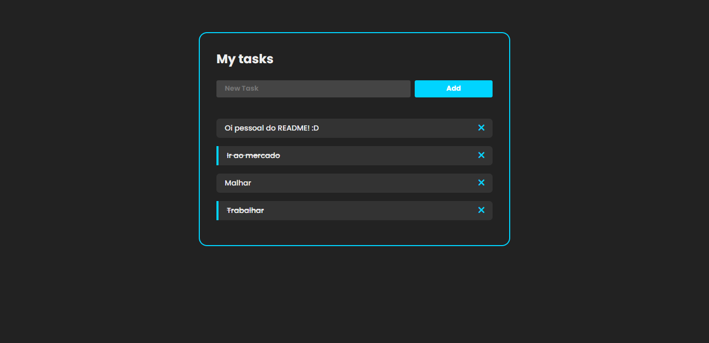

<h1 align="center">Lista de tarefas - Diogo Jorge</h1>

<h1 align="center">
    <a href="https://diogofernandoj.github.io/react-tasks" target="blank">
        
        <small align="center">Clique para visitar o projeto🔗</small>
    </a>
</h1>

## 📕 Sobre

Esse é meu primeiro projeto React, nele aprendi conceitos básicos sobre o React e pude reforçar ainda mais minhas habilidades Javascript, utlizando métodos como: map() e filter(), além da utilização de Hooks como o useState, ainda sei muito pouco sobre essa tecnologia, mas é só o começo, esse é meu novo desafio!

## ⚙ Ferramentas utilizadas

Para este projeto utilizei as seguintes tecnologias:

- HTML5
- CSS3
- React.JS
